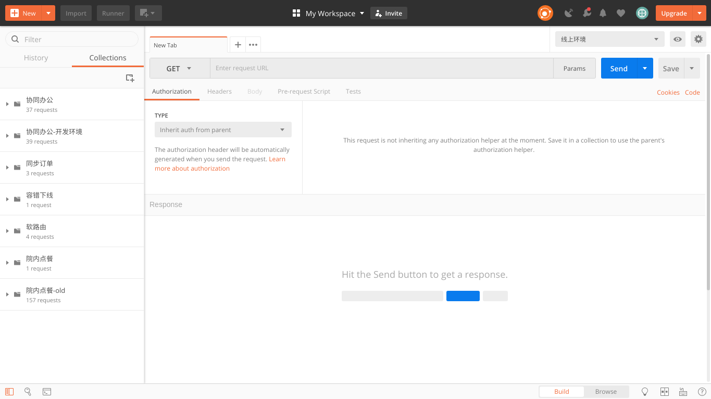
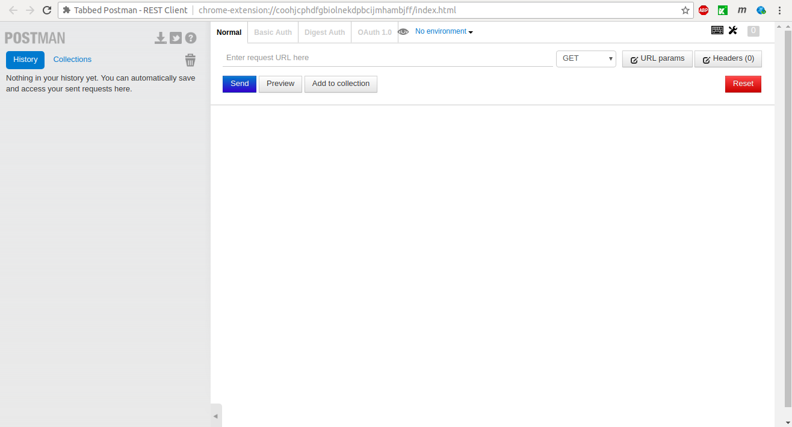
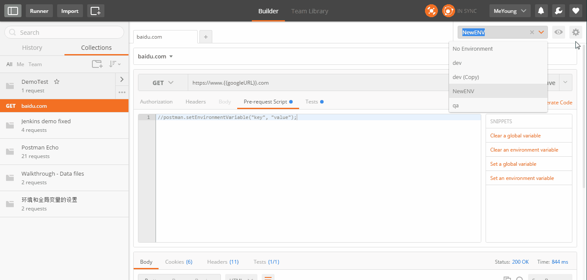
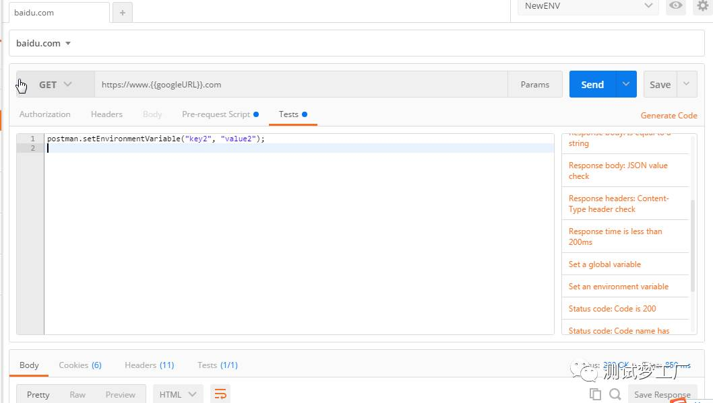
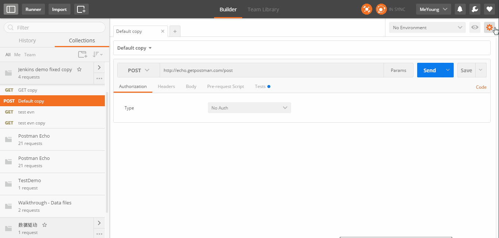
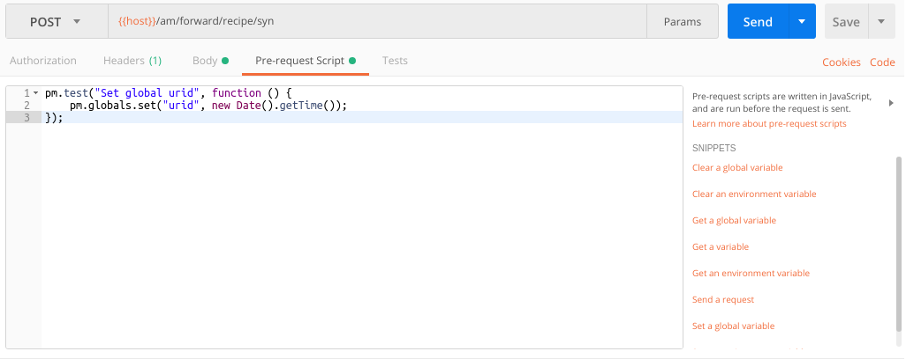
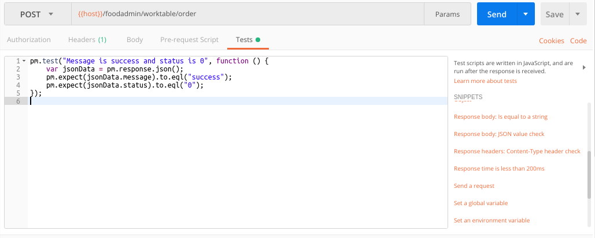
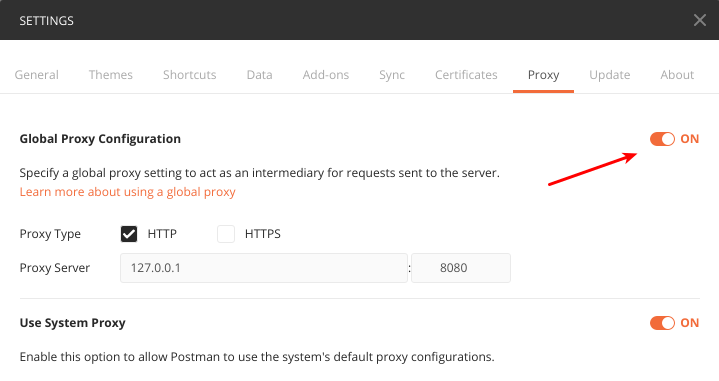
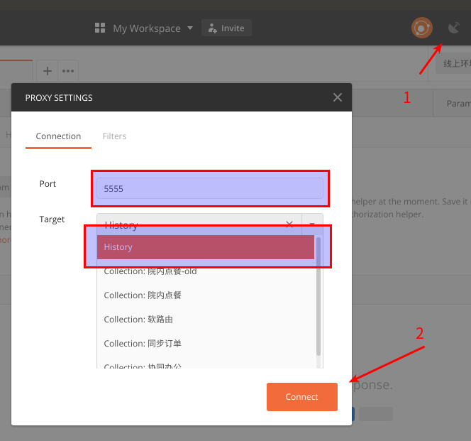

# POSTMAN入门

zhoukuo@2018-08-29

Postman是一款功能强大的网页调试与发送网页HTTP请求的工具。Postman能够发送任何类型的HTTP请求(GET, HEAD, POST,PUT...)，附带任何数量的参数和HTTP headers。支持不同的认证机制（basic, digest,OAuth...），接收到的响应语法高亮（HTML，JSON或XML）。

## 安装

Postman最早是以Chrome浏览器的插件的形式提供，后来随着用户量越来越大，便以独立的应用程序方式使用，

官方下载地址 ：https://www.getpostman.com/apps



如果你觉得安装一个应用比较麻烦，有个非官方的Chrome浏览器插件可用，叫做Tabbed Postman，非常方便。

https://chrome.google.com/webstore/detail/tabbed-postman-rest-clien/coohjcphdfgbiolnekdpbcijmhambjff?hl=zh-CN




## 变量设置

编写的API往往需要在多个环境下执行，而Postman 提供了两种类型的变量：环境变量和全局变量，从而很好的解决了这个问题。 环境变量有效范围仅仅在于你所选取的环境，全局变量对所有的环境都适用。

### 环境变量

API可能需要在不同的环境中运行，所以API请求的服务器地址不能写死，希望是可以配置的，创建环境变量有多种方式。

- 手工预先创建环境变量


- 代码自动创建环境变量

  自动新建环境变量可在两种情况下创建，但是创建方式相同都是用了postman提供的方法： 

  ````javascript
  pm.environment.set("variable_key", "variable_value");
  ````

  - 在某个请求发起之前创建： 在Pre-request Script标签里面添加代码：

    

  - 在某个请求发起之后创建： 在Tests标签里面添加如下：

    

### 全局变量

全部变量跟环境变量的创建类似，也可以通过手工预先创建或者通过代码去创建。

```js
pm.globals.set("variable_key", "variable_value");
```

- 手工预先创建

  

- 通过代码创建

  - 在请求发起前创建 在Pre-request Script标签里面添加代码
  - 在请求发起后创建 在Tests标签里面添加。

### 变量引用

在需要的地方加上{{变量名}}便可


## 随机数

PostMan除了提供环境变量和全局变量外，还提供了三种随机数：

- {{$guid}}  			添加一个V4风格GUID
- {{$timestamp}}            当前的时间戳，精确到秒
- {{$randomInt}}            0和1000之间的随机整数

生成随机的id是经常会用到的，但是在实际的测试中发现上面三种随机数都不适用：

1. V4风格GUID包含中划线（-），在有些场景中不适用，
2. {{$timestamp}} 只能随机到秒，也就是说1秒钟只能发送一次请求
3. {{$randomInt}}经常重复

实在没办法了，只能自己实现了，下面的这个函数生成的随机数精确到毫秒级，基本保证永不重复：

```javascript
pm.test("Set global uuid", function () {
    pm.globals.set("uuid", new Date().getTime());
});
```


## 请求前操作（Pre-request Script）

就是想在发送请求前执行的操作，比如这里的urid，需要在每次请求前随机生成。右侧的列表是Postman给出的一些常用的操作，可以在这些代码基础上进行修改。



## 请求后操作（Tests）

就是在请求完成后需要做的操作，比如验证返回值、清理环境变量或全局变量，或者其它任何操作。右侧的列表是Postman给出的一些常用的操作，可以在这些代码基础上进行修改。



## 移动端抓包

抓包一般会使用Fiddler或者Charles，其实Postman也是可以抓包的：

首先，打开设置选项，将Global Proxy Configuration设置为ON



然后，选择Proxy Settings，默认端口：5555，默认Target： History，然后Connect即可




## Postman Interceptor

## Newman

## 附录一：内置脚本说明

## 附录二：自定义函数说明

##### 随机id

```javascript
//随机id
pm.test("set global variable urid", function () {
    pm.globals.set("urid", new Date().getTime());
});
```

##### 当前时间

```js
//当前时间
pm.test("set global variable now", function () {
    var date = new Date();
    var seperator1 = "-";
    var seperator2 = ":";
    var month = date.getMonth() + 1;
    var strDate = date.getDate();
    if (month >= 1 && month <= 9) {
        month = "0" + month;
    }
    if (strDate >= 0 && strDate <= 9) {
        strDate = "0" + strDate;
    }
    var currentdate = date.getFullYear() + seperator1 + month + seperator1 + strDate
            + " " + date.getHours() + seperator2 + date.getMinutes()
            + seperator2 + date.getSeconds();
    
    pm.globals.set("now", currentdate);
});
```

##### 随机姓名

```javascript
//随机姓名
pm.test("Set global name",function(){
    var lastNames="李王张刘陈杨黄赵周吴徐孙朱马胡郭林何高梁郑罗宋谢唐韩曹许邓萧冯程蔡彭潘袁董苏叶吕魏蒋田杜丁沈姜范江傅钟卢汪戴崔任陆姚方金邱夏谭贾邹石熊孟秦阎薛侯雷白段郝孔邵史毛常万顾赖武贺严尹钱龚";
    var firstNames = "伟勇军磊涛斌强鹏杰峰超波辉刚健明亮俊飞凯浩华平鑫毅林洋宇敏宁建兵旭雷锋彬龙翔阳剑东博威海巍晨帅岩江松文云力成琦进昊宏欣坤冰锐震楠佳忠庆杨新骏君栋青帆静荣立虎哲晖玮瑞光钢丹坚振晓祥良春晶猛星政智琪永迪冬琳胜康彪乐诚志维卫睿捷群森洪扬科奇铭航利鸣恒源聪凡颖欢昕";
    
    var lastName = lastNames[Math.round((Math.random())*(lastNames.length-1))];
    var firstName = "";

    var length = Math.round((Math.random())*1+1);
    for ( var i = 0; i<length; i++ ) {
        let nameChar = firstNames[Math.round((Math.random())*(firstNames.length-1))];
        firstName = firstName + nameChar;
    }
    
    var name = lastName+firstName;
    
    pm.globals.set("name",name);
});
```

##### 随机年龄

```js
//随机年龄
pm.test("set global variable age",function(){
    var age = Math.round((Math.random())*80+1);
    pm.globals.set("age",age);
});
```

##### 随机性别

```js
//随机性别
pm.test("set global variable sex",function(){
    var sexs = "男女";
    var sex = sexs[Math.round((Math.random())*1)];
    pm.globals.set("sex",sex);
});
```

##### 随机手机号

```js
//随机手机号
pm.test("set global variable mobile",function(){
    var prefixArray = new Array("130", "131", "132", "133", "134", "135", "136", "137", "138", "139", "145", "147", "149", "150", "151", "152", "153", "155", "156", "157", "158", "159", "166", "171", "172", "173", "175", "176", "177", "178", "180", "181", "182", "183", "184", "185", "186", "187", "188", "189", "198", "199");
    var i = parseInt(42 * Math.random());
    var mobile = prefixArray[i];
    for (var j = 0; j < 8; j++) {
        mobile = mobile + Math.floor(Math.random() * 10);
    }
    
    pm.globals.set("mobile", mobile);
});
```

##### 随机身份证号

```js
//随机身份证号
pm.test("set global variable idNo",function(){
    var coefficientArray = [ "7","9","10","5","8","4","2","1","6","3","7","9","10","5","8","4","2"];// 加权因子
    var lastNumberArray = [ "1","0","X","9","8","7","6","5","4","3","2"];// 校验码
    
    var address = "420101"; // 住址
    var birthday = "19810101"; // 生日

    var s = Math.floor(Math.random()*10).toString() + Math.floor(Math.random()*10).toString() + Math.floor(Math.random()*10).toString();
    var array = (address + birthday + s).split(""); 
    var total = 0;
    for(var i in array){
        total = total + parseInt(array[i])*parseInt(coefficientArray[i]);
    } 
    var lastNumber = lastNumberArray[parseInt(total%11)];
    var id_no_String = address + birthday + s + lastNumber;

    pm.globals.set("idNo", id_no_String);
});

```

##### 随机订单数据分类

```js
//随机订单数据分类
pm.test("Set global dataCategory",function(){
    var dataCategorys = new Array("QT", "MZBL", "ZYBL", "JYJL", "BGD", "YZD");
    var dataCategory = dataCategorys[parseInt((Math.random())*dataCategorys.length)];
    pm.globals.set("dataCategory",dataCategory);
});
```

##### 随机职称和标识码

```js
//随机职称和标识码
pm.test("Set global variable dataCategory",function(){
    var titleCodes = new Array("ZLYS", "SXYS", "ZYYS", "ZZYS", "FZRYS", "ZRYS", "XHS", "HS", "ZGHS", "FZRHS", "ZRHS", "QT");
    var titles = new Array("助理医师", "实习医师", "住院医师","主治医师", "副主任医师", "主任医师", "护士", "护师", "主管护师", "副主任护师", "主任护师", "其他");
    var index = parseInt((Math.random())*titleCodes.length);
    var titleCode = titleCodes[index];
    var title = title[index];
    pm.globals.set("titleCode",titleCode);
    pm.globals.set("title",title);
});
```

##### 生成随机科室

```js
//生成随机科室
pm.test("set global variable department",function(){
    var departments = new Array("儿科", "眼科", "胸科", "骨科", "耳鼻喉科");
    var i = parseInt(5 * Math.random());
    var department = departments[i];
    pm.globals.set("department", department);
}); 
```
##### 生成随机执业资格证类别

```js
//生成随机执业资格证类别
pm.test("set global variable idType",function(){
    var idTypes = new Array("YS", "YZ");
    var i = parseInt(2 * Math.random());
    var idType = idTypes[i];
    pm.globals.set("idType", idType);
}); 
```

生成随机证件类型

```js
//生成随机证件类型
pm.test("set global variable idNoType",function(){
    var idNoTypes = new Array("SF", "HZ");
    var i = parseInt(2 * Math.random());
    var idNoType = idNoTypes[i];
    pm.globals.set("idNoType", idNoType);
}); 
```