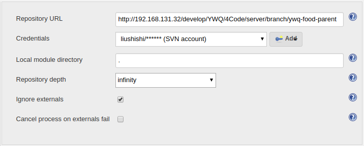
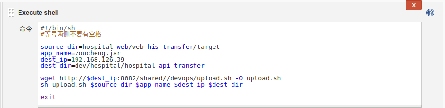
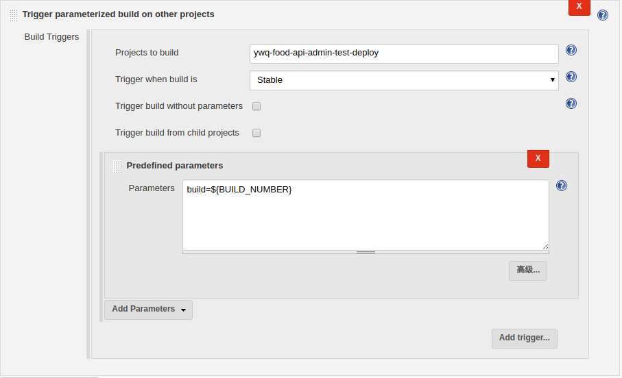
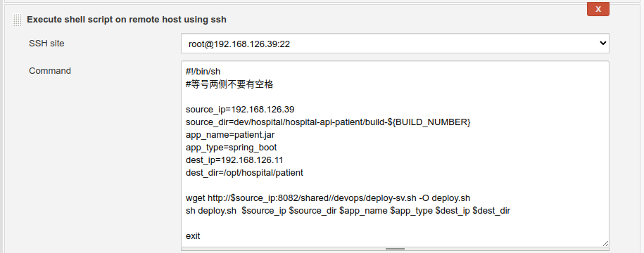

# Jenkins CI/CD配置

zhoukuo@2018-06-26

## 构建

构建任务主要用来产生布署文件，包括jar包/war包、配置文件、库文件、版本说明文件等，后面布署时基于构建的产出物来进行。

### 同步代码



代码仓库地址：支持SVN或Git，无论是什么环境都使用相同的代码仓库地址。

用户账号：用户SVN或Git账号，如果在Jenkins中不存在，点击旁边的Add按钮添加。

### 执行构建命令

- #### MAVEN项目构建

因为是Java项目，构建命令使用Maven，这里需要注意的是，参数中要指明产出物用于什么环境，对应-P参数，可选值为：dev/test/pre/production。

```bash
clean install -pl hospital-web/hospital-web-patient -am -P dev
```


- #### NPM项目构建

前端项目大多采用NPM构建，具体构建命令如下：

```bash
npm i node-sass --sass_binary_site=https://npm.taobao.org/mirrors/node-sass/
npm install;npm run build|grep -v 'emitted'

```

### 构建产出物收集与上传

由于构建产出物可能会有多个，直接使用上传插件比较麻烦，因此建议在这里放在同一目录下，方便一次性上传到文件服务器。

目前规范为：**统一放在workspace/output目录下**。

这里在创建版本文件时，用到了Jenkins环境变量，${BUILD_NUMBER}是当前的build号，${SVN_REVISION}是SVN的reversion。

```bash
touch food-api-admin-${BUILD_NUMBER}-rev.${SVN_REVISION}
```

产出物上传时，要注意几点：

- 上传到哪个服务器
- 放在哪个目录下
- 更新到builld-latest目录下

#### 上传到哪个服务器

规范要求：

- 开发与测试环境的产出物统一存放在本地文件服务器，即：http://192.168.126.39:8082
- 预上线与线上环境的产出物统一存放在阿里云平台，即：http://47.95.231.203:8082

#### 放在哪个目录下

无论是哪个环境，存放目录都是在/opt/builds/<环境>/<产品>/<服务>/<build>下面，例如：

```bash
/opt/builds/dev/food/food-api-admin/build-10
```

#### 更新到builld-latest目录下

build-latest始终存放最新的build，这样，如果想布署最新的build就无需查看具体的build号了。

```
#!/bin/sh
#等号两侧不要有空格
 
source_dir=hospital-web/hospital-web-patient/target
app_name=patient.jar
dest_ip=192.168.126.39
dest_dir=dev/hospital/hospital-api-patient
 
wget http://$dest_ip:8082/shared//devops/upload.sh -O upload.sh
sh upload.sh $source_dir $app_name $dest_ip $dest_dir
 
exit
```



### 触发布署任务

如果希望在构建完成后自动触发部署任务，可以在这里使用这个插件自动调用本次构建的build，这里同样用到了Jenkins的环境变量：${BUILD_NUMBER}，意思是布署本次build的产出物。



## 部署

布署任务用来将构建产出物布署到目标节点上，布署任务只做一件事：

```
执行shell布署脚本
```

```
#!/bin/sh
#等号两侧不要有空格
 
source_ip=192.168.126.39
source_dir=dev/hospital/hospital-api-patient/build-${BUILD_NUMBER}
app_name=patient.jar
app_type=spring_boot
dest_ip=192.168.126.11
dest_dir=/opt/hospital/patient
 
wget http://$source_ip:8082/shared//devops/deploy-sv.sh -O deploy.sh
sh deploy.sh  $source_ip $source_dir $app_name $app_type $dest_ip $dest_dir

exit
```


首先要选择执行节点，执行节点有2个可选，分别是：

- 内网环境执行节点
- 云平台执行节点

内网环境的布署无论是开发环境还是测试环境统一都从内网环境执行节点布署，地址为：192.168.126.39

集成环境和线上环境统一都从云平台执行节点布署，地址为：47.95.231.203

这里会调用deploy.sh脚本，具体示例请参考——通用的布署脚本，deploy的示例。

