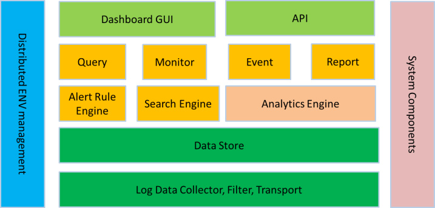
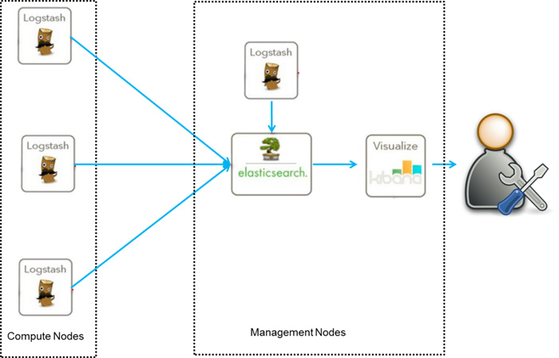
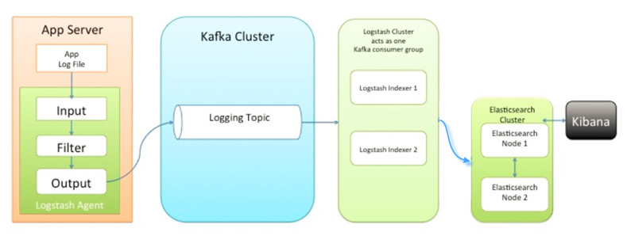
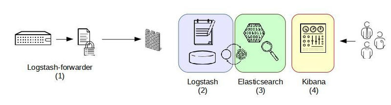
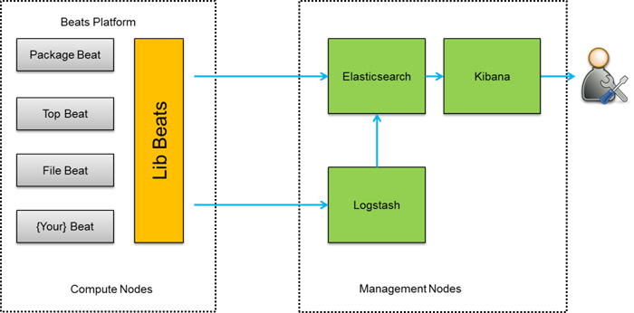

# ELK-集中式日志解决方案

zhoukuo@2019-09-10

ELK是一组开源软件的简称，其包括Elasticsearch、Logstash 和 Kibana。ELK最近几年发展迅速，已经成为目前最流行的集中式日志解决方案。

### Elasticsearch
Elasticsearch是实时全文搜索和分析引擎，提供搜集、分析、存储数据三大功能；是一套开放REST和JAVA API等结构提供高效搜索功能，可扩展的分布式系统。它构建于Apache Lucene搜索引擎库之上。

### Logstash
Logstash是一个用来搜集、分析、过滤日志的工具。它支持几乎任何类型的日志，包括系统日志、错误日志和自定义应用程序日志。它可以从许多来源接收日志，这些来源包括 syslog、消息传递（例如 RabbitMQ）和JMX，它能够以多种方式输出数据，包括电子邮件、websockets和Elasticsearch。

### Kibana 
Kibana是一个基于Web的图形界面，用于搜索、分析和可视化存储在 Elasticsearch指标中的日志数据。它利用Elasticsearch的REST接口来检索数据，不仅允许用户创建他们自己的数据的定制仪表板视图，还允许他们以特殊的方式查询和过滤数据。

### Filebeat
Filebeats是一种轻量级的日志搜集器，其不占用系统资源，自出现之后，迅速更新了原有的ELK架构。Filebeats将收集到的数据发送给Logstash解析过滤，在Filebeats与Logstash传输数据的过程中，为了安全性，可以通过SSL认证来加强安全性。之后将其发送到Elasticsearch存储，并由Kibana可视化分析。

## 为什么要使用ELK

一般我们需要进行日志分析场景：直接在日志文件中 grep、awk 就可以获得自己想要的信息。但在规模较大的场景中，此方法效率低下，面临问题包括日志量太大如何归档、文本搜索太慢怎么办、如何多维度查询。需要集中化的日志管理，所有服务器上的日志收集汇总。常见解决思路是建立集中式日志收集系统，将所有节点上的日志统一收集，管理，访问。

一般大型系统是一个分布式部署的架构，不同的服务模块部署在不同的服务器上，问题出现时，大部分情况需要根据问题暴露的关键信息，定位到具体的服务器和服务模块，构建一套集中式日志系统，可以提高定位问题的效率。

一个完整的集中式日志系统，需要包含以下几个主要特点：

- 收集－能够采集多种来源的日志数据；
- 传输－能够稳定的把日志数据传输到中央系统；
- 存储－如何存储日志数据；
- 分析－可以支持UI分析；
- 警告－能够提供错误报告，监控机制；

ELK提供了一整套解决方案，并且都是开源软件，之间互相配合使用，完美衔接，高效的满足了很多场合的应用。

## 应用场景

在海量日志系统的运维中，以下几个方面是必不可少的：

- 分布式日志数据集中式查询和管理；
- 系统监控，包含系统硬件和应用各个组件的监控；
- 故障排查；
- 安全信息和事件管理；
- 报表功能；

ELK组件各个功能模块如下图所示，

它运行于分布式系统之上，通过搜集、过滤、传输、储存，对海量系统和组件日志进行集中管理和准实时搜索、分析，使用搜索、监控、事件消息和报表等简单易用的功能，帮助运维人员进行线上业务的准实时监控、业务异常时及时定位原因、排除故障、程序研发时跟踪分析Bug、业务趋势分析、安全与合规审计，深度挖掘日志的大数据价值。

同时Elasticsearch提供多种API（REST JAVA PYTHON等API）供用户扩展开发，以满足其不同需求。

汇总ELK组件在大数据运维系统中，主要可解决的问题如下：

- 日志查询，问题排查，上线检查；
- 服务器监控，应用监控，错误报警，Bug管理；
- 性能分析，用户行为分析，安全漏洞分析，时间管理；

## Filebeat工作原理
Filebeat由两个主要组件组成：prospectors 和 harvesters。这两个组件协同工作将文件变动发送到指定的输出中。

### Harvester
Harvester负责读取单个文件内容。每个文件会启动一个Harvester，每个Harvester会逐行读取各个文件，并将文件内容发送到制定输出中。

Harvester负责打开和关闭文件，意味在Harvester运行的时候，文件描述符处于打开状态，如果文件在收集中被重命名或者被删除，Filebeat会继续读取此文件。所以在Harvester关闭之前，磁盘不会被释放。

默认情况filebeat会保持文件打开的状态，直到达到close_inactive（如果此选项开启，filebeat会在指定时间内将不再更新的文件句柄关闭，时间从harvester读取最后一行的时间开始计时。若文件句柄被关闭后，文件发生变化，则会启动一个新的harvester。

关闭文件句柄的时间不取决于文件的修改时间，若此参数配置不当，则可能发生日志不实时的情况，由scan_frequency参数决定，默认10s。

Harvester使用内部时间戳来记录文件最后被收集的时间。例如：设置5m，则在Harvester读取文件的最后一行之后，开始倒计时5分钟，若5分钟内文件无变化，则关闭文件句柄。默认5m）。

### Prospector
负责管理Harvester并找到所有读取源。
Prospector会找到/apps/logs/*目录下的所有info.log文件，并为每个文件启动一个Harvester。Prospector会检查每个文件，看Harvester是否已经启动，是否需要启动，或者文件是否可以忽略。若Harvester关闭，只有在文件大小发生变化的时候Prospector才会执行检查。只能检测本地的文件。

Filebeat会将文件状态记录在文件中（默认在/var/lib/filebeat/registry）。此状态可以记住Harvester收集文件的偏移量。若连接不上输出设备，如ES等，filebeat会记录发送前的最后一行，并再可以连接的时候继续发送。Filebeat在运行的时候，Prospector状态会被记录在内存中。Filebeat重启的时候，利用registry记录的状态来进行重建，用来还原到重启之前的状态。每个Prospector会为每个找到的文件记录一个状态，对于每个文件，Filebeat存储唯一标识符以检测文件是否先前被收集。

Filebeat之所以能保证事件至少被传递到配置的输出一次，没有数据丢失，是因为filebeat将每个事件的传递状态保存在文件中。在未得到输出方确认时，filebeat会尝试一直发送，直到得到回应。若filebeat在传输过程中被关闭，则不会再关闭之前确认所有时事件。任何在filebeat关闭之前为确认的时间，都会在filebeat重启之后重新发送。这可确保至少发送一次，但有可能会重复。可通过设置shutdown_timeout 参数来设置关闭之前的等待事件回应的时间（默认禁用）。

## Logstash工作原理
Logstash事件处理有三个阶段：inputs → filters → outputs。是一个接收，处理，转发日志的工具。支持系统日志，webserver日志，错误日志，应用日志，总之包括所有可以抛出来的日志类型。

### Input
输入数据到logstash，一些常用的输入为：

- file：从文件系统的文件中读取，类似于tial -f命令；
- syslog：在514端口上监听系统日志消息，并根据RFC3164标准进行解析；
- redis：从redis service中读取；
- beats：从filebeat中读取；

### Filters
数据中间处理，对数据进行操作，一些常用的过滤器为：

grok：解析任意文本数据，Grok 是 Logstash 最重要的插件。它的主要作用就是将文本格式的字符串，转换成为具体的结构化的数据，配合正则表达式使用。内置120多个解析语法。
 
官方提供的grok表达式：https://github.com/logstash-plugins/logstash-patterns-core/tree/master/patterns

grok在线调试：https://grokdebug.herokuapp.com/

- mutate：对字段进行转换。例如对字段进行删除、替换、修改、重命名等。
- drop：丢弃一部分events不进行处理。
- clone：拷贝 event，这个过程中也可以添加或移除字段。
- geoip：添加地理信息(为前台kibana图形化展示使用)

### Outputs
outputs是logstash处理管道的最末端组件。一个event可以在处理过程中经过多重输出，但是一旦所有的outputs都执行结束，这个event也就完成生命周期。一些常见的outputs为：

- elasticsearch：可以高效的保存数据，并且能够方便和简单的进行查询。
- file：将event数据保存到文件中。
- graphite：将event数据发送到图形化组件中，一个很流行的开源存储图形化展示的组件。

### Codecs 
codecs 是基于数据流的过滤器，它可以作为input，output的一部分配置。Codecs可以帮助你轻松的分割发送过来已经被序列化的数据。一些常见的codecs：

- json：使用json格式对数据进行编码/解码。
- multiline：将汇多个事件中数据汇总为一个单一的行。比如：java异常信息和堆栈信息。

## Elasticsearch
Elasticsearch 是一个分布式的搜索和分析引擎，可以用于全文检索、结构化检索和分析，并能将这三者结合起来。Elasticsearch 基于 Lucene 开发，现在是使用最广的开源搜索引擎之一。

### 基本概念

### node
即一个 Elasticsearch 的运行实例，使用多播或单播方式发现 cluster 并加入。
### cluster
包含一个或多个拥有相同集群名称的 node，其中包含一个master node。
### index
类比关系型数据库里的DB，是一个逻辑命名空间。
### alias
可以给 index 添加零个或多个alias，通过 alias 使用index 和根据index name 访问index一样，但是，alias给我们提供了一种切换index的能力，比如重建了index，取名customer_online_v2，这时，有了alias，我要访问新 index，只需要把 alias 添加到新index 即可，并把alias从旧的 index 删除。不用修改代码。
### type
类比关系数据库里的Table。其中，一个index可以定义多个type，但一般使用习惯仅配一个type。
### mapping
类比关系型数据库中的 schema 概念，mapping 定义了 index 中的 type。mapping 可以显示的定义，也可以在 document 被索引时自动生成，如果有新的 field，Elasticsearch 会自动推测出 field 的type并加到mapping中。
### document
类比关系数据库里的一行记录(record)，document 是 Elasticsearch 里的一个 JSON 对象，包括零个或多个field。
### field
类比关系数据库里的field，每个field 都有自己的字段类型。
### shard
是一个Lucene 实例。Elasticsearch 基于 Lucene，shard 是一个 Lucene 实例，被 Elasticsearch 自动管理。之前提到，index 是一个逻辑命名空间，shard 是具体的物理概念，建索引、查询等都是具体的shard在工作。shard 包括primary shard 和 replica shard，写数据时，先写到primary shard，然后，同步到replica shard，查询时，primary 和 replica 充当相同的作用。replica shard 可以有多份，也可以没有，replica shard的存在有两个作用，一是容灾，如果primary shard 挂了，数据也不会丢失，集群仍然能正常工作；二是提高性能，因为replica 和 primary shard 都能处理查询。另外，如上图右侧红框所示，shard数和replica数都可以设置，但是，shard 数只能在建立index 时设置，后期不能更改，但是，replica 数可以随时更改。

## Kibana
Kibana是一个开源的分析与可视化平台，设计出来用于和Elasticsearch一起使用的。可以用kibana搜索、查看、交互存放在Elasticsearch索引里的数据，使用各种不同的图表、表格、地图等kibana能够很轻易地展示高级数据分析与可视化。

## ELK架构

第一种ELK架构，是最简单的一种ELK架构方式。优点是搭建简单，易于上手。缺点是Logstash耗资源较大，运行占用CPU和内存高。另外没有消息队列缓存，存在数据丢失隐患。建议供学习者和小规模集群使用。此架构首先由Logstash分布于各个节点上搜集相关日志、数据，并经过分析、过滤后发送给远端服务器上的Elasticsearch进行存储。Elasticsearch将数据以分片的形式压缩存储并提供多种API供用户查询，操作。用户亦可以更直观的通过配置Kibana Web Portal方便的对日志查询，并根据数据生成报表。

第二种架构，引入了消息队列机制，位于各个节点上的Logstash Agent先将数据/日志传递给Kafka（或者Redis），并将队列中消息或数据间接传递给Logstash，Logstash过滤、分析后将数据传递给Elasticsearch存储。最后由Kibana将日志和数据呈现给用户。因为引入了Kafka（或者Redis）,所以即使远端Logstash server因故障停止运行，数据将会先被存储下来，从而避免数据丢失。这种架构适合于较大集群的解决方案，但由于Logstash中心节点和Elasticsearch的负荷会比较重，可将他们配置为集群模式，以分担负荷，这种架构的优点在于引入了消息队列机制，均衡了网络传输，从而降低了网络闭塞尤其是丢失数据的可能性，但依然存在Logstash占用系统资源过多的问题。

第三种架构，引入了Logstash-forwarder。首先，Logstash-forwarder将日志数据搜集并统一发送给主节点上的Logstash，Logstash分析、过滤日志数据后发送至Elasticsearch存储，并由Kibana最终将数据呈现给用户。这种架构解决了Logstash在各计算机点上占用系统资源较高的问题。经测试得出，相比Logstash，Logstash-forwarder所占用系统CPU和MEM几乎可以忽略不计。另外，Logstash-forwarder和Logstash间的通信是通过SSL加密传输，起到了安全保障。如果是较大集群，用户亦可以如结构三那样配置logstash集群和Elasticsearch集群，引入High Available机制，提高数据传输和存储安全。更主要的配置多个Elasticsearch服务，有助于搜索和数据存储效率。但在此种架构下发现Logstash-forwarder和Logstash间通信必须由SSL加密传输，这样便有了一定的限制性。

第四种架构，将Logstash-forwarder替换为Beats。经测试，Beats满负荷状态所耗系统资源和Logstash-forwarder相当，但其扩展性和灵活性有很大提高。Beats platform目前包含有Packagebeat、Topbeat和Filebeat三个产品，均为Apache 2.0 License。同时用户可根据需要进行二次开发。这种架构原理基于第三种架构，但是更灵活，扩展性更强。同时可配置Logstash 和Elasticsearch 集群用于支持大集群系统的运维日志数据监控和查询。

小结：不管采用上面哪种ELK架构，都包含了其核心组件，即：Logstash、Elasticsearch 和Kibana。当然这三个组件并非不能被替换，只是就性能和功能性而言，这三个组件已经配合的很完美，是密不可分的。究竟该采用哪种架构，可根据现实情况和架构优劣而定。

## 参考
以下是ELK官方文档，供大家参考：

#### Elasticsearch
https://www.elastic.co/cn/products/elasticsearch
https://www.elastic.co/guide/en/elasticsearch/reference/6.2/index.html

#### Logstash
https://www.elastic.co/cn/products/logstash
https://www.elastic.co/guide/en/logstash/6.2/index.html

#### Kibana
https://www.elastic.co/cn/products/kibana
https://www.elastic.co/guide/en/kibana/6.2/index.html

#### Elasticsearch中文社区
https://elasticsearch.cn/
