# Kong-API网关介绍(研发视角)

zhoukuo@2019-10-31

在微服务架构中，由于系统和服务的细分，导致系统结构变得非常复杂，为了跨平台，为了统一集中管理API，同时为了不暴露后置服务。甚至有时候需要对请求进行一些认证、安全、负载均衡、限流、熔断等中间操作。

基于此类种种的客观需求，一个类似综合前置的系统就产生了，这就是API网关(API Gateway)。

API网关作为分散在各个业务系统微服务的API聚合点和统一接入点，外部请求通过访问这个接入点，即可访问内部所有的REST API服务。

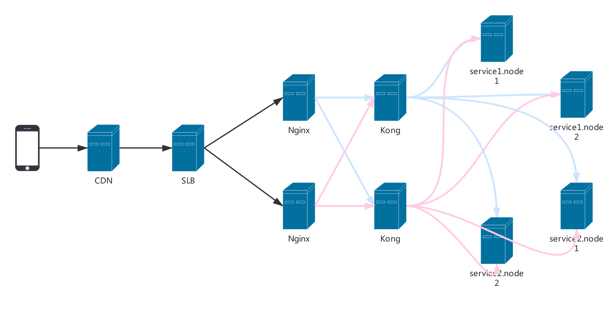

## 为什么要引入Kong
简单来说引入Kong主要解决以下几个问题：
- 反向代理
- 负载均衡
- 指标监控
- 热更新
- 健康检查
- 服务治理（认证、访问控制、限流、熔断、黑白名单等）


### 反向代理、负载均衡——Nginx是怎么做的

#### upstream

```
upstream flowable_server {
    server 192.168.126.73:8080 weight=1;
    server 192.168.126.74:8080 weight=1;
}
```

#### location

```
location /flowable-modeler {
	proxy_pass		http://flowable_server;
}

location /flowable-task {
	proxy_pass		http://flowable_server;
}

location /flowable-idm {
	proxy_pass		http://flowable_server;
}
```

### 反向代理、负载均衡——Kong怎么做

#### upstream

http://192.168.126.21:1337/#!/upstreams

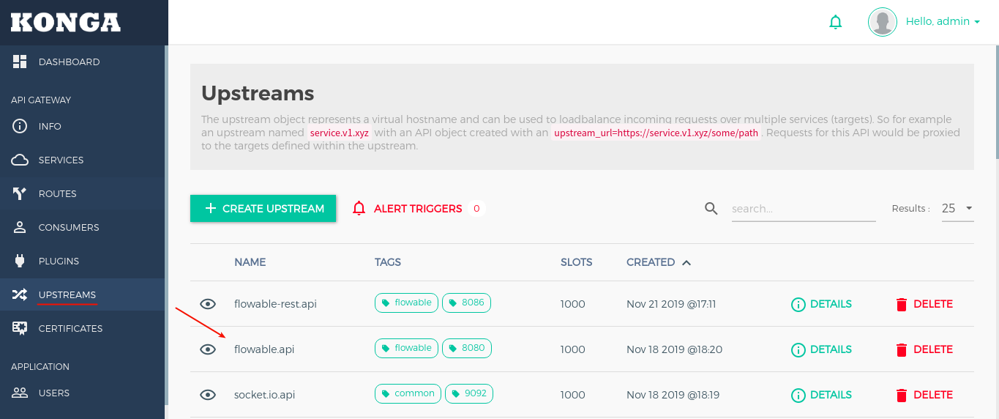

#### service

http://192.168.126.21:1337/#!/services

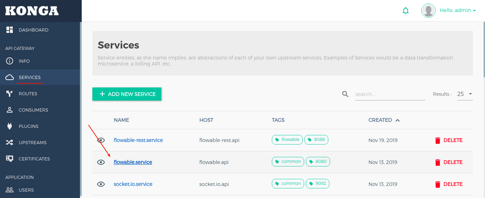

#### route

http://192.168.126.21:1337/#!/routes

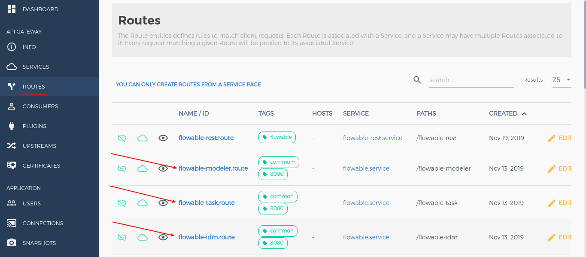

### 指标监控 —— Nginx怎么做
- 流量
- 响应时间
- 带宽使用
- 40x统计、50x统计

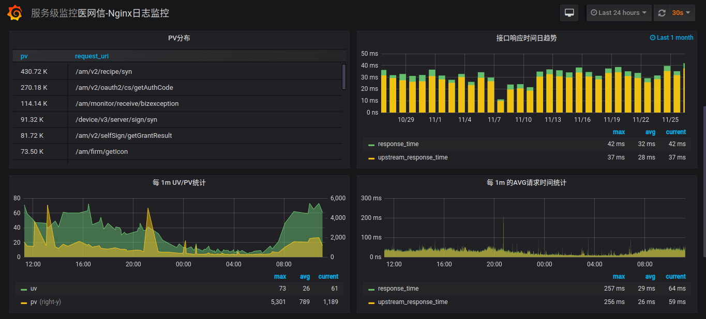


### 指标监控 —— Kong怎么做
- 按服务统计流量
- 按服务、按状态码统计响应时间
- 按服务统计带宽使用

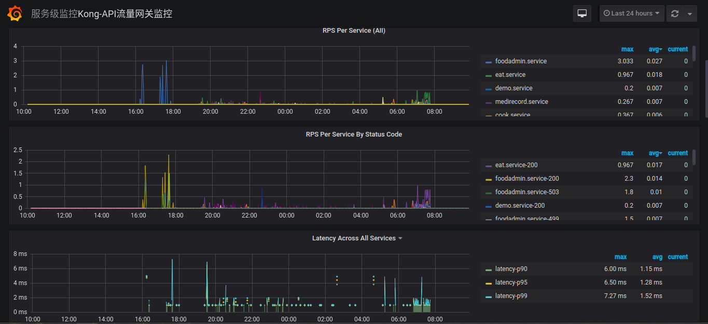


## Kong的使用场景(研发视角)

### 1. 查看服务代理和负载配置
- 查询服务路由
- 查询服务负载节点和端口

### 2. 负载节点操作

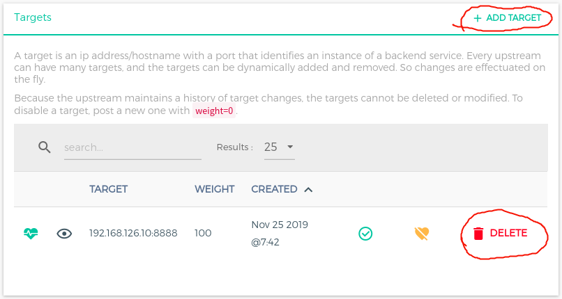

1. 添加负载节点 —— 添加target（无法修改）
2. 调整权重（weight）—— 权重无法直接修改，可通过再次添加相同的target来更新权重
3. 移除负载节点 —— 删除target

**注意：set unhealthy 按钮会导致服务不稳定，切勿使用！！！**

### 3. 灰度发布

为了配合生产环境的上线，专门提供一个Kong的实例，用于灰度发布（数据库指向kongpre，切记！！！）。

#### 灰度策略
1. 搭建专门用于灰度发布的Kong的实例（布署在192.168.1.6），和生产的Kong实例的区别为upstream只配置灰度的target（H区节点，长期有效）
2. 判断请求来源IP如果为公司的公网IP（60.247.93.190）时，全部转到灰度的Kong实例上（这条规则长期有效，不会随着上线的动作修改）

#### 上线步骤
1. 下线灰度节点（下线灰度节点前，确认AB节点同时在线上）
2. 布署灰度节点，回归测试
3. 测试通过后，上线灰度节点
4. 下线另一个节点，布署服务后，上线

#### 需要注意的问题
1. 增加Kong的灰度实例后，生产Kong的配置变更，同时要在灰度的Kong实例做同样的变更（target保持单节点），确保两个实例配置同步
2. 公司内网访问通过灰度的Kong实例，和客户的访问路由有区别，排查问题时，需要注意一下！
3. 每次上线后需要对Kong的配置进行备份，并注明是哪个迭代上线，或者哪个服务的线上bug修复，以便出现问题可以追溯

### 3. 查看服务监控指标

http://bi.51trust.com/d/mY9p7dQmz/kong-apiliu-liang-wang-guan-jian-kong?orgId=1

#### 监控指标

##### 1. 流量（RPS）

每秒处理的请求数目，等效于QPS

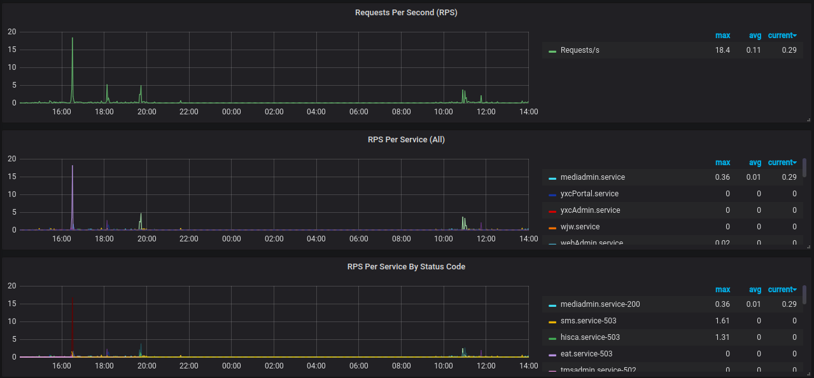

##### 2. 延迟（Latency）

表示Kong接收来自客户端的请求并将请求发送到上游服务

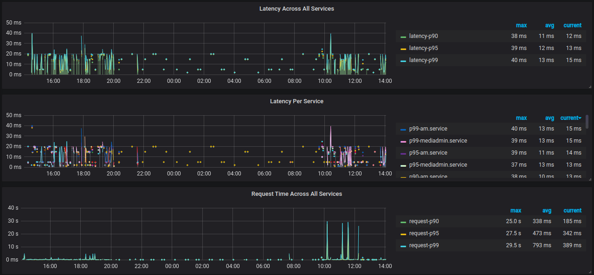

##### 3. 响应时间（Request Time）

从接受用户请求的第一个字节到发送完响应数据，与客户端是否收到响应无关

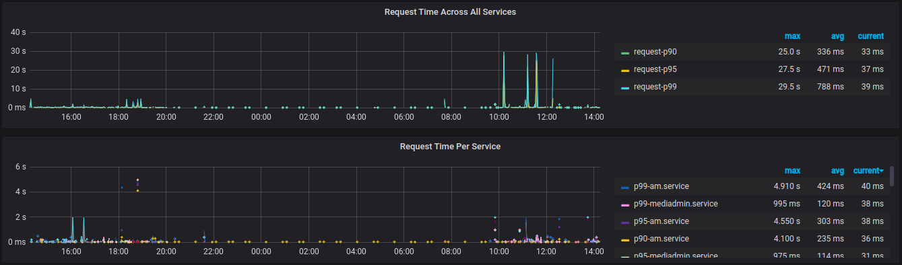

##### 4. 服务端响应时间（Upstream Time）

从Nginx建立连接开始，到发送完响应数据

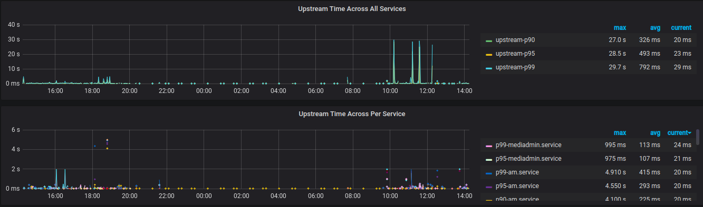

##### 5. Request Time VS Upstream Time

如果把整个过程补充起来的话，应该是：

[1用户请求］——［2建立Nginx连接］——［3发送响应］——［4接收响应］——［5关闭Nginx连接］

upstream_time: 2,3,4,5

request_time: 1,2,3,4,5

Upstream Time 比 Request Time 少了［1用户请求］的时间，如果用户端网络状况较差或者传递数据本身较大，再考虑到，当使用POST方式传参时 Nginx会先把request body缓存起来，这样就解释了
为什么 request_time 有可能会比 upstream_time 要大很多

##### 5. 带宽用量（BandWidth）

每秒请求的字节数，Ingress：下行带宽，Egress：上行带宽

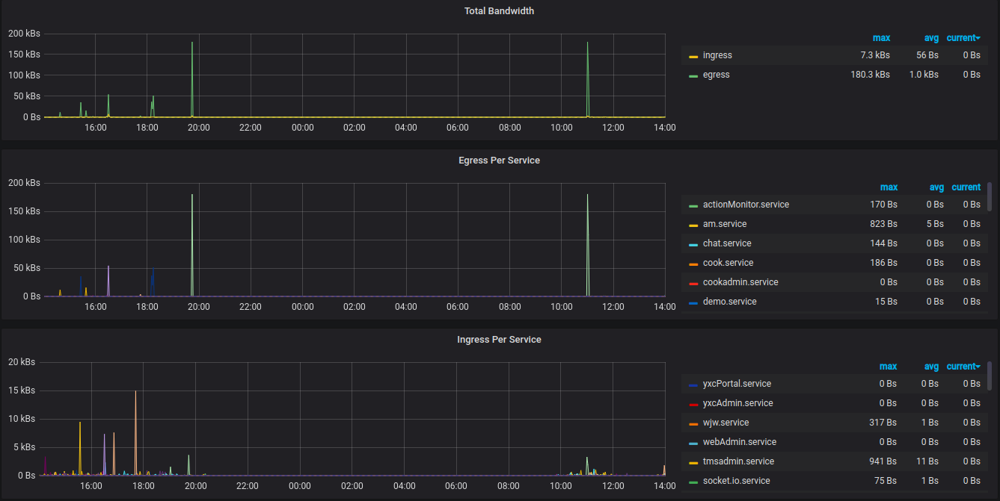

##### 6. 内存使用率

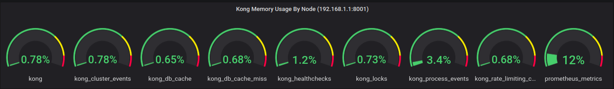

## 健康检查

用户可以使用Kong的 ring-balancer 配置 API 代理，ring-balancer 会在多个 target 之间实现负载均衡，并基于 upstream 配置对每个 target 进行健康检查，针对它们是否正常响应判定它们是否健康，之后 ring-balancer 仅会将流量路由到健康的 target，Kong支持两种健康检查，可以单独使用，也可以结合使用：

- 主动检查：定期检查 target 中指定的 Http 或 Https 端点，并根据其响应确定 target 的运行状况
- 被动检查：也称为断路器，Kong会分析正在运行的代理流量，并根据其响应请求行为确定 target 的运行状况

两类健康检查器总结
- 主动健康检查器可以在 target 恢复健康之后自动恢复流量；但是被动健康检查器不能
- 被动健康检查器不会产生额外的流量；主动健康检查器会
- 主动健康检查器需要一条URL路径可以访问，作为探测的端点（通常简单配置为"/"）；被动检查器不需要这样的配置
- 应用可以根据自身的健康指标生成一个状态码，提供给主动健康检查器，这样即使 target 还能持续提供给被动健康检查器流量，同时也能响应主动健康检查器的错误状态
- 用户可以组合使用者两种模式，例如使用被动检查器仅根据流量状态监控该 target 健康与否，再仅在非健康状态情况下使用主动检查器，以便自动重启该 target

**注意：开启Active health checks 时，Unhealthy TCP failures 必须设置为 > 0。**

### 主动健康检查配置

|KEY|DESCRIPTION|
|-|-|
|healthchecks.active.http_path|向目标发出HTTP GET请求时应使用的路径，默认值为“/”|
|healthchecks.active.timeout|探测的HTTP GET请求的连接超时限制。默认值为1秒|
|healthchecks.active.concurrency|在活动运行状况检查中同时检查的目标数|
|healthchecks.active.healthy.interval|针对健康目标的活动健康检查之间的间隔（以秒为单位），值为零表示不应执行健康目标的活动探测|
|healthchecks.active.unhealthy.interval|针对不健康目标的活动健康检查之间的间隔（以秒为单位），值为零表示不应执行不健康目标的活动探测|
|healthchecks.active.healthy.successes|多少次通过健康检查后判定为成功|
|healthchecks.active.unhealthy.tcp_failures|活动探测器中考虑目标不健康的TCP故障数，多少次健康检查失败后判定为不健康|
|healthchecks.active.unhealthy.timeouts|活动探测器中考虑目标不健康的超时次数|
|healthchecks.active.unhealthy.http_failures|活动探测器中考虑目标不健康的HTTP故障数，多少次不通过健康检查后判定为失败|

### 被动健康检查配置
|KEY|DESCRIPTION|
|-|-|
|healthchecks.passive.healthy.successes|HTTP状态成功次数的阈值，这个值需要设置为正值|
|healthchecks.passive.unhealthy.tcp_failures|TCP失败计数器|
|healthchecks.passive.unhealthy.timeouts|超时次数阈值|
|healthchecks.passive.unhealthy.http_failures|HTTP状态失败次数的阈值|

### 停用健康检查

对于健康检查中所有的阈值和间隔，将它们设置为0，就可以禁用该属性表示的功能，将探测的间隔时间设为0可以禁用该探测，这样用户可以对健康检查程序的行为进行细粒度的控制

总结起来：

禁用主动健康检查，需要将 healthchecks.active.healthy.interval和 healthchecks.active.unhealthy.interval 这两个参数都设为0；

禁用被动健康检查，需要将被动健康检查的阈值都设置为0

默认情况下，健康检查器中的所有阈值和时间间隔默认值都为0，这意味着新创建的 upstream 默认情况下是完全禁用健康检查的


## 服务治理
在请求到达kong之后，转发给后端应用之前，你可以应用kong自带的插件对请求进行处理，合法认证，限流控制，黑白名单校验，日志采集等等。同时，你也可以按照kong的教程文档，定制开发属于自己的插件。

Kong的插件主要分五大类
- Authentication认证
- Security安全
- Traffic Control流量控制
- Analytics & Monitoring分析&监控
- Logging日志
- 其他

常用的插件
- rate-limiting（限流）
- ip-restriction（黑白名单）
- Basic Authentication（授权认证）
- Prometheus(指标监控)

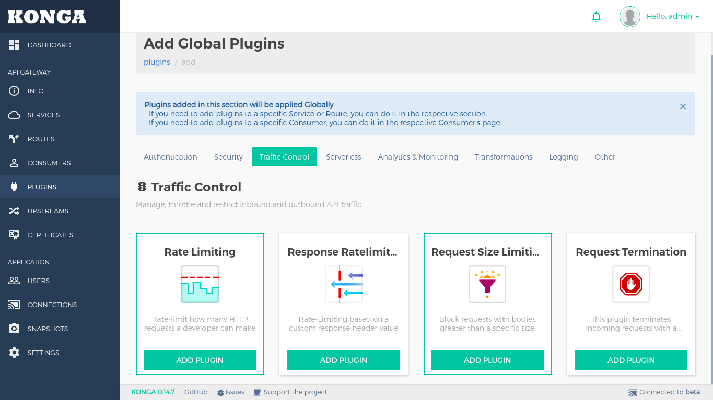


## 相关资源

- Kong安装布署指南
- API网关升级布署方案
- Kong配置指南
- PostgreSQL11安装布署指南
- Kong官网：https://konghq.com/kong/
