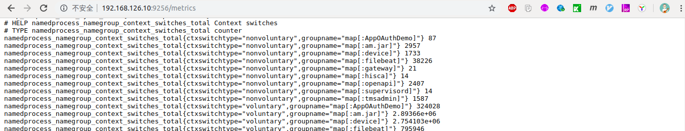
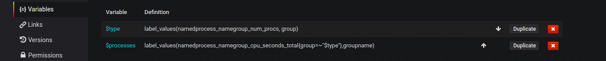
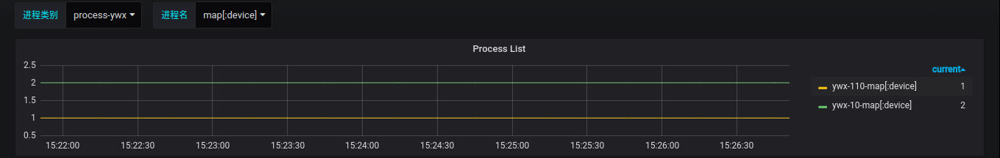
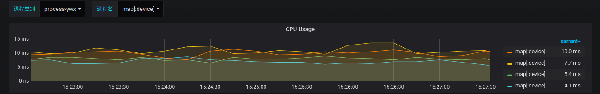
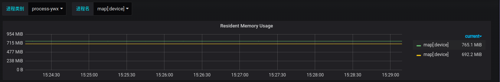
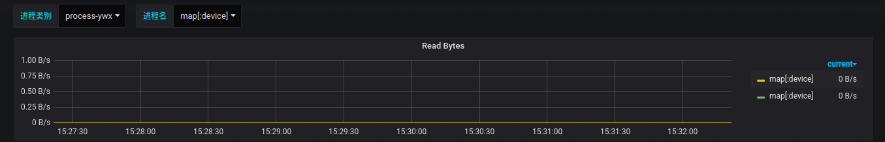
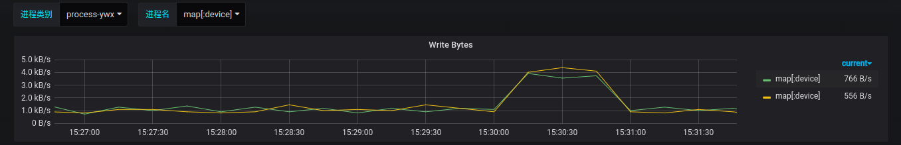
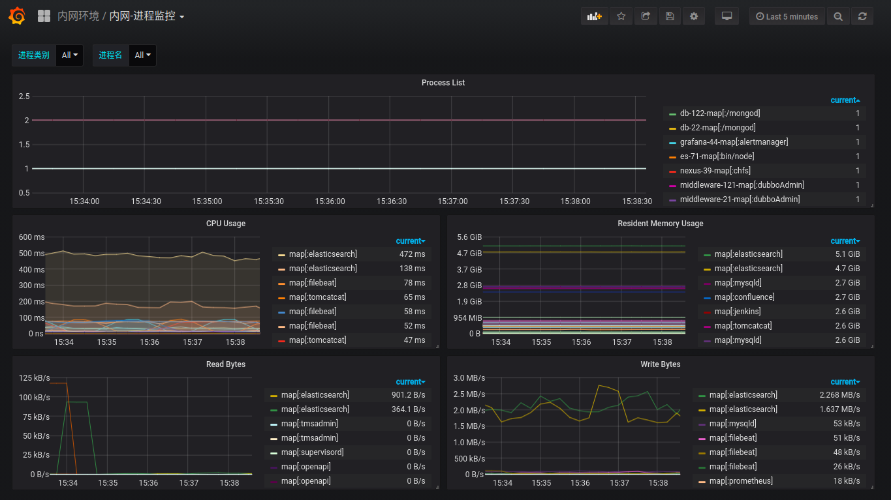

# Promethus监控之—进程监控

zhoukuo@2019-09-26

进程监控主要用于监控全部或指定进程占用系统资源的情况，如CPU,内存、设备IO、任务切换、线程等。

## 为什么需要进程监控
- 确保进程始终运行
- 确保进程资源使用率处于合理范围

## 监控指标
- 是否存在
- CPU、内存使用率
- IO读写

## 告警指标
- 进程退出告警

## 安装配置
由于node_exporter不包含进程指标的监控，这里我们使用process-exporter对进程进行监控

### Process-Exporter 安装配置

#### 1.Process-Exporter下载

下载地址：https://github.com/ncabatoff/process-exporter/releases

```bash
[root@a ~]# wget https://github.com/ncabatoff/process-exporter/releases/download/v0.5.0/process-exporter-0.5.0.linux-amd64.tar.gz
[root@a ~]# tar -xvf process-exporter-0.5.0.linux-amd64.tar.gz -C /opt/exporter/process-exporter

```

#### 2.创建配置文件
process-exporter 依赖一个配置文件，描述哪些进程需要监控，以下是可用的模板变量：

- \{{.Comm}} 包含原始可执行文件的basename，/proc//stat 中的换句话说，2nd 字段
- \{{.ExeBase}} 包含可执行文件的basename
- \{{.ExeFull}} 包含可执行文件的完全限定路径
- \{{.Matches}} 映射包含应用命令行tlb所产生的所有匹配项

process-exporter 可以进程名字匹配进程，获取进程信息。匹配规则由name对应的模板变量决定，以下表示监控进程名字为nginx 与 zombie 的进程状态
```bash
[root@es process-exporter]# vi process.yml
```
```yaml
process_names:

  - name: "{{.Matches}}"
    cmdline:
    - 'nginx'

  - name: "{{.Matches}}"
    cmdline:
    - 'zombie'
```

#### 3.启动服务
```bash
[root@es process-exporter]# ./process-exporter -config.path process.yml &
```

#### 4.查看监控数据
可打开地址 http://localhost:9256/metrics 来确认是否有抓取到数据



### Promethues配置
Promethus监控的模型为pull模型，只有在Promethus的target配置文件中增加对应exporter的ip地址和端口才能将对应的监控指标数据保存到Promethus中
```bash
[root@prometheus targets_config]# vi process_target.yml
```
```yaml
- targets: ['192.168.122.110:9256']
  labels:
    group: "process-ywx"
    service_name: 'ywx-110'

- targets: ['192.168.122.10:9256']
  labels:
    group: "process-ywx"
    service_name: 'ywx-10'
```
通过查询指标：namedprocess_namegroup_num_procs，可以看到如下的结果：


接下来，就可以配置监控面板了

### 监控面板配置 —— Named Processes Dashboard
下载地址：https://grafana.com/api/dashboards/1860

### 变量定义
- type：进程类别
- processes：进程列表



### 变量配置

type变量表达式：
```
label_values(namedprocess_namegroup_num_procs, group)
```

processes变量表达式：
```
label_values(namedprocess_namegroup_cpu_seconds_total{group=~"$type"},groupname)
```
详细的配置项见下图


### Panel展示

- Process List

```
namedprocess_namegroup_num_procs{group=~"$type", groupname=~"$processes"}
```


- CPU Usage

```
rate(namedprocess_namegroup_cpu_seconds_total{group=~"$type", groupname=~"$processes"}[1m])
```


- Resident Memory Usage

```
namedprocess_namegroup_memory_bytes{group=~"$type", groupname=~"$processes", memtype="resident"}
```


- Read Bytes

```
rate(namedprocess_namegroup_read_bytes_total{group=~"$type", groupname=~"$processes"}[1m])
```


- Write Bytes

```
rate(namedprocess_namegroup_write_bytes_total{group=~"$type", groupname=~"$processes"}[1m])
```


### 最终的Dashboard



<完>