# Apifox试用总结

zhoukuo@2020-08-11

根据官方的介绍，它的定位是比Postman更好用的接口管理平台。为什么好用呢，Apifox = Postman + Swagger + Mock + JMeter，
翻译过来就是说Apifox的功能包括：接口文档、调试、Mock、自动化测试、团队协作，也就是说他要做的是功能整合。

## 账号

第一次启动Apifox，需要用户登录，如果没有账号，就注册一个。

## 团队管理

登录成功后，默认会有一个以账号命名的团队，可以邀请成员，并且可以分配权限，权限包括：管理员、普通成员、只读成员、禁止访问。

成员数量是否有限制，目前不清楚，文档没有描述。

团队的设置包括：更改团队名称、移交团队、解散团队。只有所有者拥有团队设置的权限。

## 项目管理

团队下可以创建多个项目，具体数量是否有限制，目前不清楚，文档没有描述。

相比Postman，Apifox强化了团队协作功能，默认有一个和账号同名的项目，默认情况下添加的接口都隶属于这个项目。

### 新建项目

新建项目可以需要设置项目名称、以及成员权限。

### 项目设置

创建成功后，通过项目设置页面，进行详细配置，比如修改项目名称，甚至是删除项目。其它设置还包括：公共Response、公共脚本、Mock设置、导入/导出数据，具体后面会介绍。

## 接口

Apifox最核心的功能都是围绕接口的，否则也不会叫Apifox了，因此接口是Apifox最重要的概念

### 新建接口

新建接口包括4个部分：基本信息，请求参数，返回Response，返回Response示例。

这是基本信息，主要用来生成文档

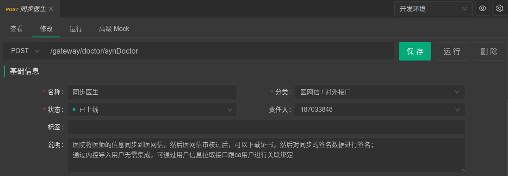

这是请求参数，这里和Postman就比较类似了，但是做了一些优化，比如这里可以一个属性一个属性的添加，也可以直接把写好的json结构直接导入，另外这里还可以设置mock规则，方便测试，同时还可以添加备注信息，也是为了生成文档的需要。

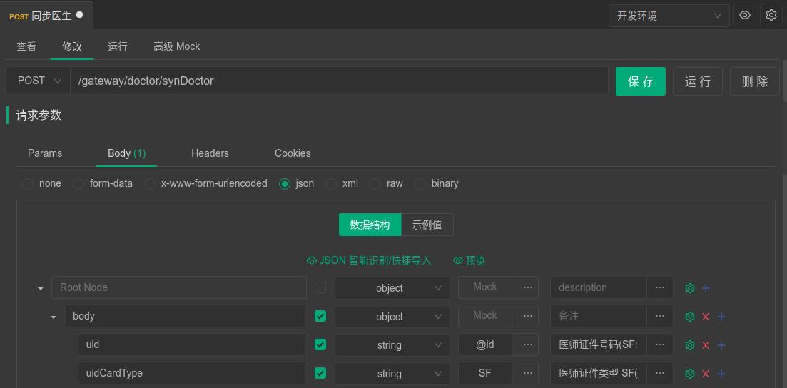

同时，这里还可以根据设置的mock规则生成测试数据，这里需要说明一下，即使不设置任何mock规则，Apifox也会根据匹配规则，自动生成mock数据，官方的说法叫“零配置mock”，一方面方便生成示例，另一方面可以简化生成测试数据。

这里着重讲一下测试数据的生成，这个功能对于测试人员非常有帮助，没有mock数据功能之前，我们要么手工构造测试数据，效率非常低；要么通过预执行脚本设置全局或这环境变量，然后在接口数据中引用，成本也比较高，而且对测试人员的要求很高，需要会js脚本。

有了mock数据的功能，这件事变得简单了，你只需要根据参数去选择适合的mock方法就可以了。例如：有个参数是身份证号，那么你就可以选择@id这个mock方法，他会随机生成合法的身份证号，不需要其它任何工作，是不是很方便。

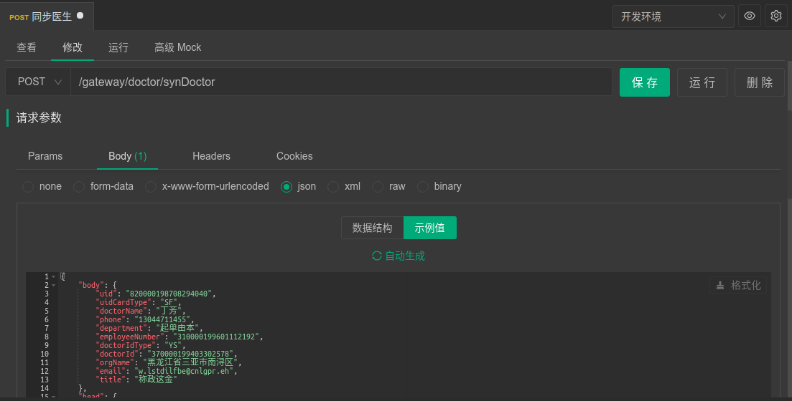

这里是返回值的配置，主要用于提供mock服务，方便前端调试。当然也用于生成文档。这里可以添加多个，包括成功的，和各种错误返回的情况

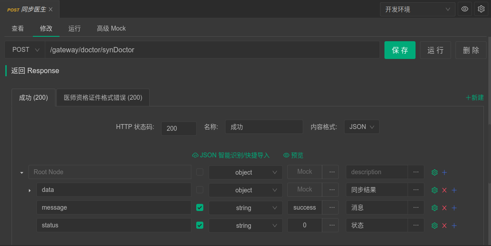

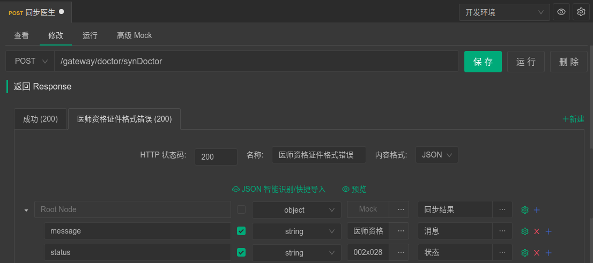

这里是返回值的示例，可以添加成功示例，也可以添加异常示例。

需要说明一下，上面的返回值配置不是有mock规则吗，这里添加示例可以直接根据上面mock规则自动生成。

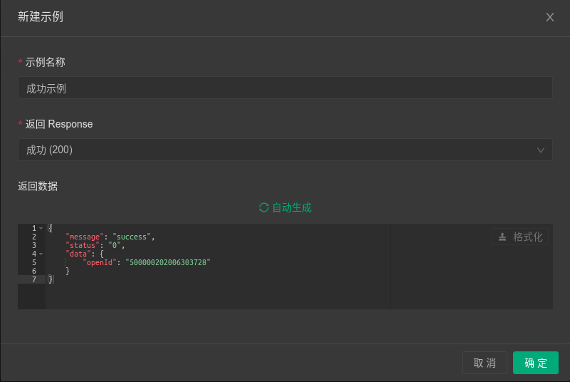

最后保存。

### 调试运行

首先要切换到“运行”页面

这个视图就比较熟悉了，页面布局和postman基本一致，不同的是，body不需要再一个一个的添加了，可以根据之前写好的参数信息一键生成，是不是非常的方便。

运行前需要做一个工作就是环境变量的设置，这个设置在Apifox中单独做为url的一部分被强化了，在postman中不是必须的。具体怎么配置不具体讲了，和postman没有区别。

然后点击“发送”按钮就可以调试了。

### 用例设计

调试成功后还可以保存成用例，方便以后使用。点击“保存”按钮，可以选择用例的名称，这里设计的非常贴心

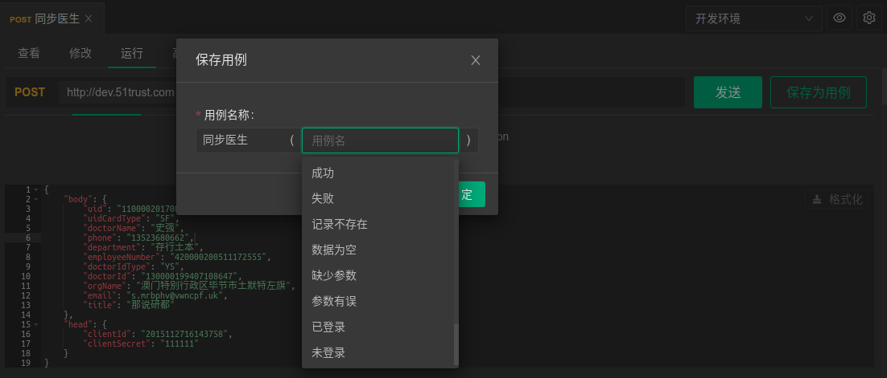

下次执行时，从左边列表中选择对应的用例执行就可以了。

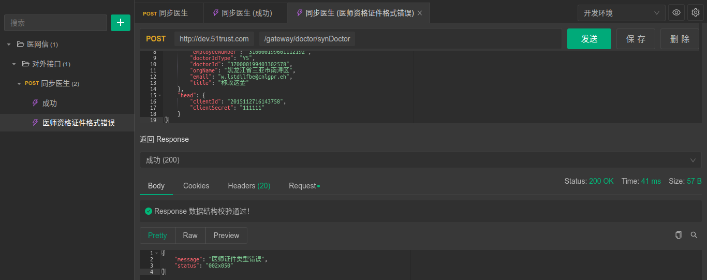

## 集合测试

当有很多的接口需要测试时，一个一个的点击运行显然是不合适的，Apifox提供了批量执行测试用例的能力

切换到“集合测试“页面

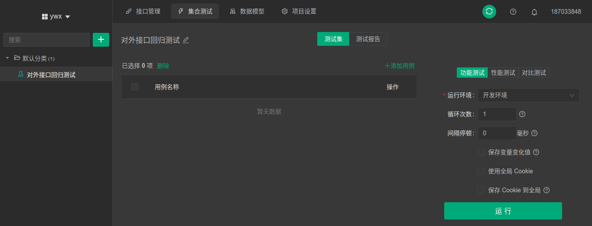

添加用例：可以按接口添加，也可以按用例添加。

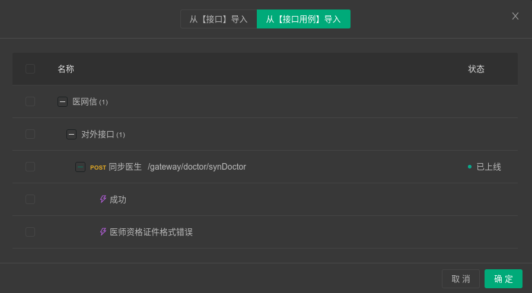

最后执行测试

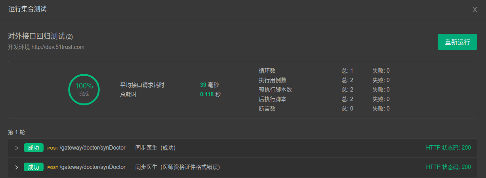

测试报告、性能测试、对比测试功能还未提供，可以期待一下。

## Mock服务

Apifox启动的同时，会自动提供的一个Mock服务，URL 为：http://127.0.0.1:4523/mock/{项目ID}{接口实际path}

默认情况下，定义好接口/数据结构后，无需做任何额外的配置，就可以通过上面的 URL 访问到自动 Mock 出来的数据接口了。

首先切换到“查看”页面，在Mock这部分列出了所有mock的列表

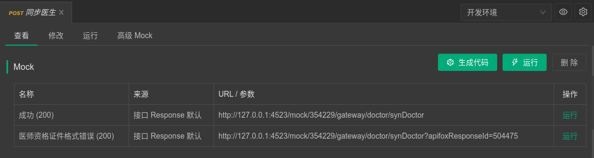

点击“运行”按钮就可以看到结果

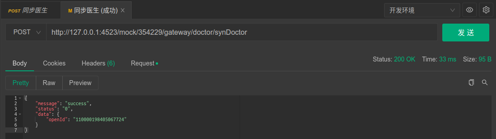

## 导出文档（数据导出）

到这里接口信息应该没有什么问题了，可以发布了，项目设置->导入/导出数据->导出数据，选择HTML格式。

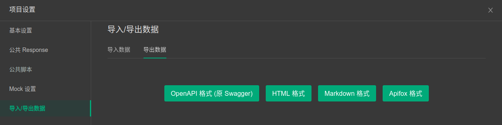

这样一个符合OAS3标准的接口文档就生成了。

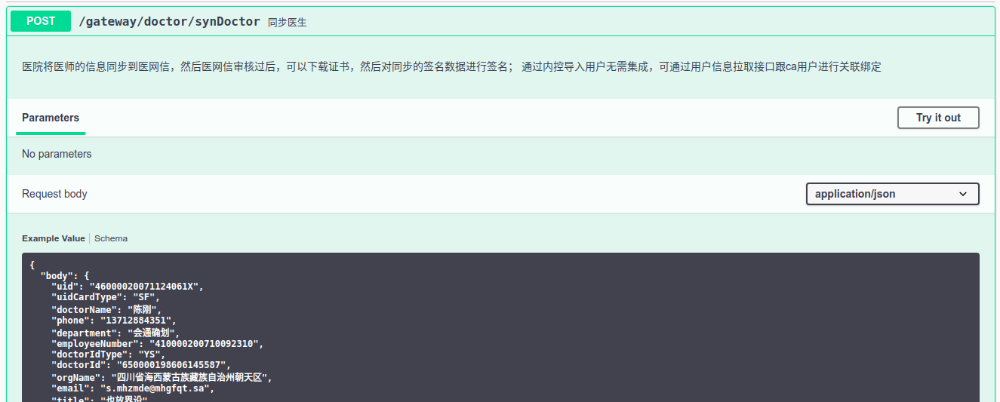

## 其他功能

前面介绍的都是常用的功能，下面我再说一些不太常用的功能：

### 数据导入

如果你已经用了其他的接口管理平台，比如postman、yapi等等，支持的格式非常多，你可以非常方便的通过导入功能完成迁移。大家可以根据自己的实际情况尝试一下。

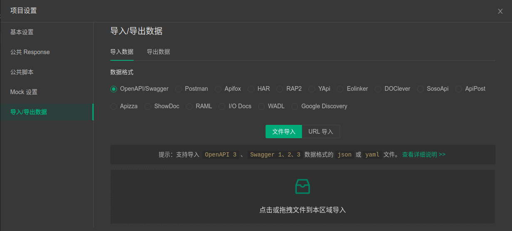

### 公共脚本

有时我们需要在运行接口前做一些准备工作，或者在接口执行完成后做一些验证工作，这个和postman一样，Apifox也是支持的，只是Apifox又向前走了一步，因为有一些操作在很多接口都需要做，如果使用postman就需要重复编写很多遍，在Apifox中，我们可以把它作为一个公共脚本提供。这样在任何接口中都可以使用。

这是公共脚本的定义的地方

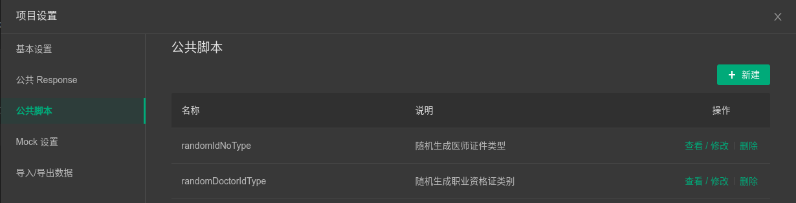

这是公共脚本的定义

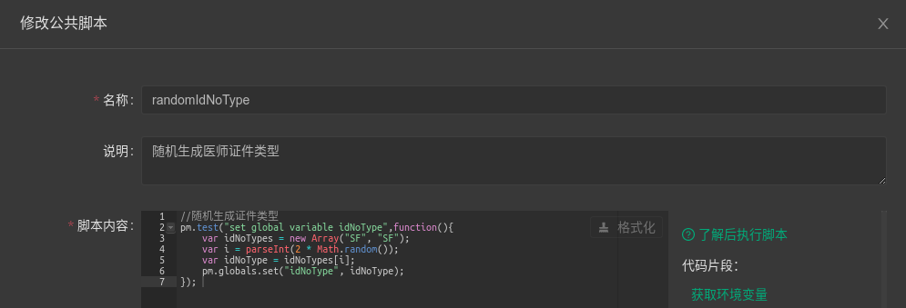

这是在接口中调用
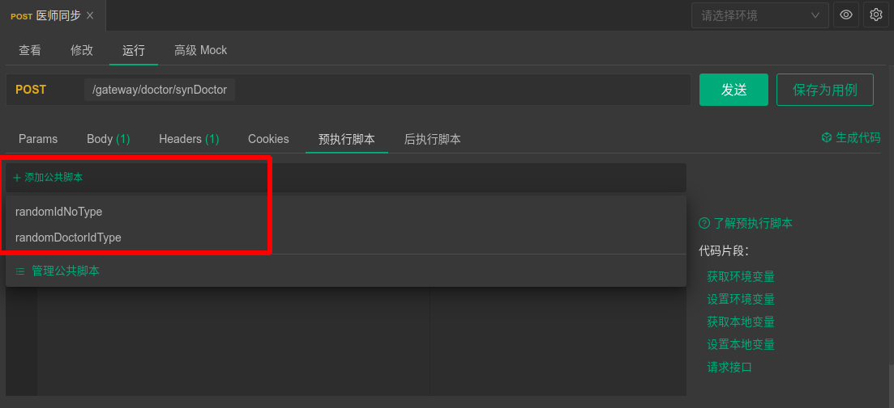

### 数据模型

这个功能我评估用到的机会不多，简单讲就是自定义数据结构，解决的问题就是当有几个字段在多个接口都存在时，可以抽象成一个数据模型，然后在每个接口中复用，感觉意义不大，不做过多介绍，了解一下即可。

## 总结

总的来说，此次试用整体感觉还是不错的，虽然有一些bug，但还是有很多可圈可点之处，推荐大家尝试一下。

