# 敏捷项目管理工具-Taiga

zhoukuo@2020-08-19

Taiga是多功能敏捷团队的项目管理工具，它提供了丰富的功能，同时通过其友好的用户界面，使用起来非常简单。

## 创建项目（Project）

在Scrum中，通常由项目负责人创建项目。

Taiga提供了四种类型的项目，通常我们选择“冲刺”类型。

填写好项目名称和描述，项目就创建成功了，默认会跳转到待办事项列表(Backlog)，这是管理用户故事的地方。

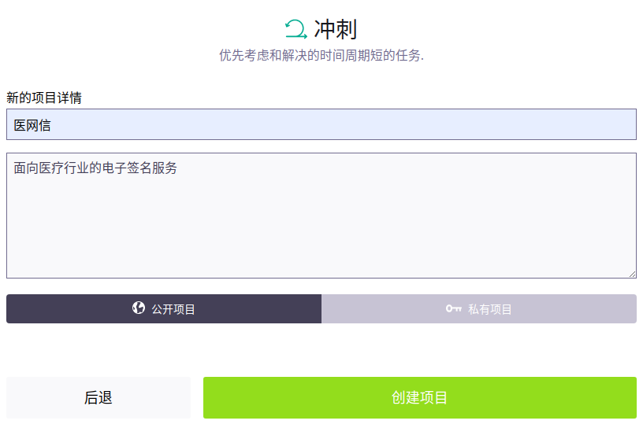

## 添加成员

Taiga添加新成员是通过邮箱来邀请的。收到邀请邮件后，登录系统（ http://192.168.126.201 ），根据提示注册即可。

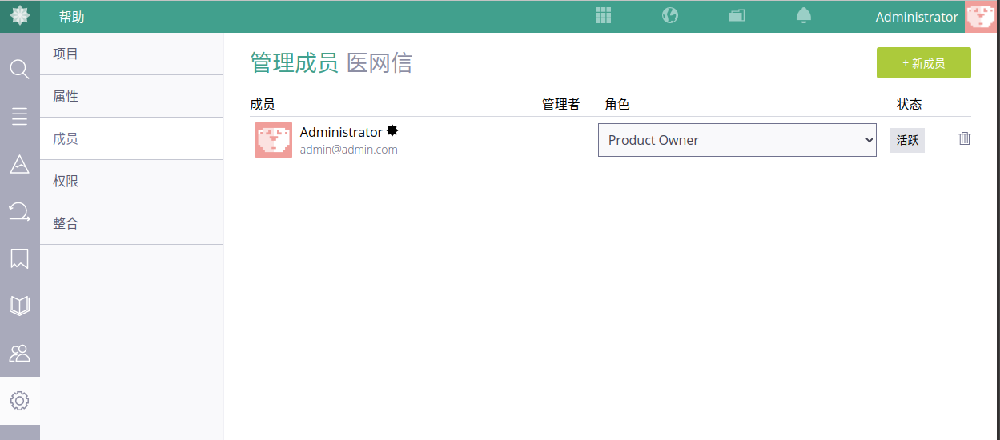

## 待办列表（Backlog）

### 添加用户故事（User Story）

在Scrum中，通常由项目负责人添加用户故事。

通过“添加用户故事”按钮，添加用户故事，“标题”是必填的，“描述”是用户故事的主要部分，“截至时间”通常也是必须的，其它信息都可以随着讨论不断完善。

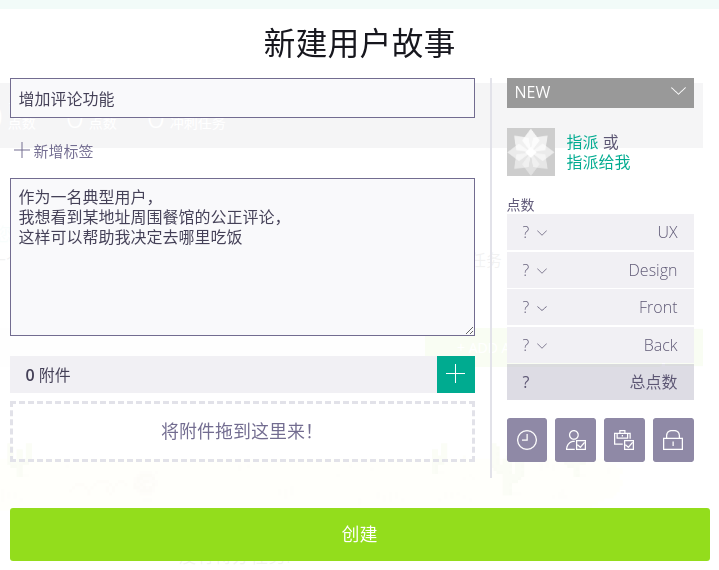

如果一次需要添加多个用户故事，批量添加也是支持的。一行一项，只输入标题，其它信息只能一个一个填写。

添加后的用户故事状态为“new”。

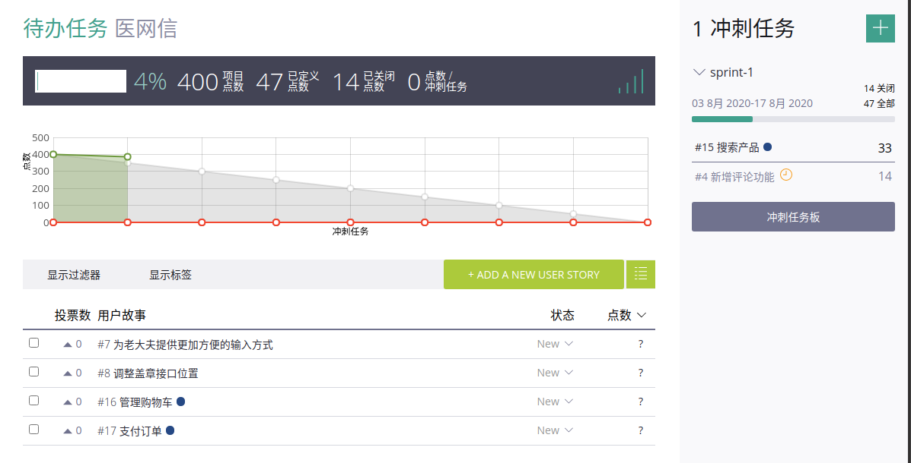

### 梳理

刚刚添加的用户故事是不能直接添加到冲刺面板中开发的，需要进行梳理。

在讨论中，如果用户故事过大，不能在一个冲刺完成，就需要进一步拆分，大的用户故事在“史诗”中管理。

Taiga提供了估算功能，各个角色可以分别对工作量进行准确的估算。

通过拖拽可以轻松为PBI排序。

梳理完成后的用户故事状态为“ready”。

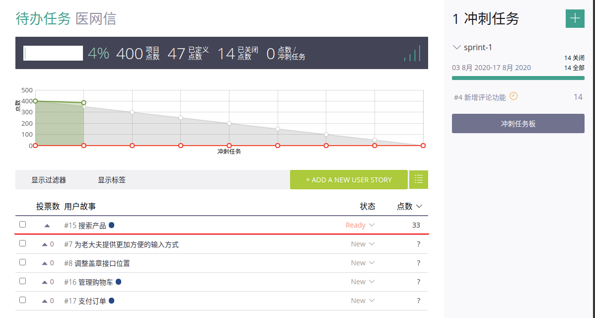

### 史诗(Epic)

在左侧工具栏找到“史诗”，通过“添加史诗”按钮把刚刚在需求列表中的较大的用户故事作为史诗添加进来。

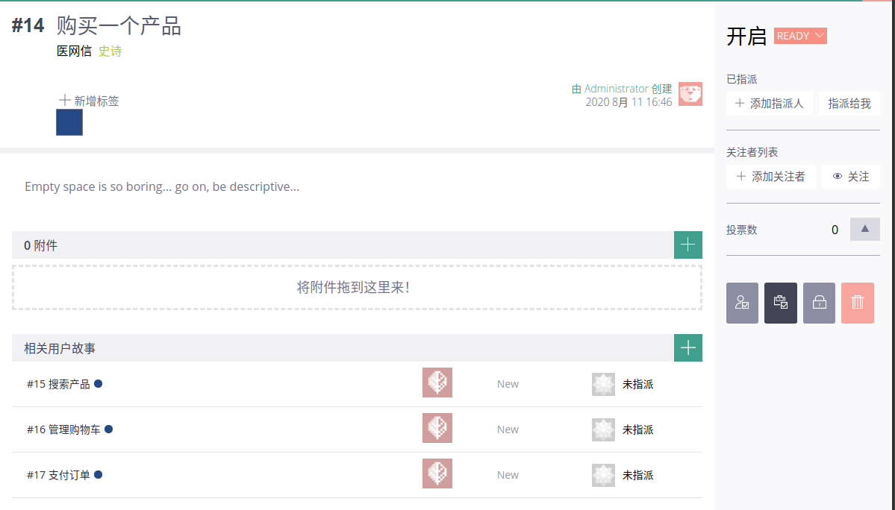

然后回到待办列表中，把大的故事拆分成几个小的用户故事，并且链接到史诗上。这样在史诗的页面中就可以实时看到史诗的进展。

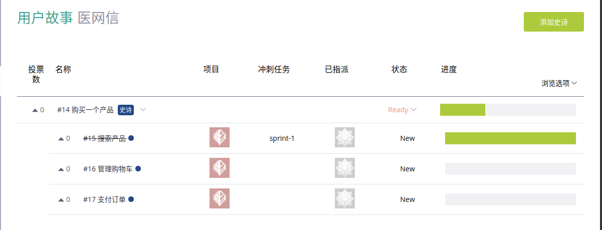

## 冲刺(Sprint)

### 制定冲刺计划

大多数Scrum团队在执行一个两周到一个月的冲刺(迭代)时，都尽量在大约4到8小时内完成冲刺(迭代)计划。

我常用的方法是遵照一个简单的循环：选择一个PBI（已排序的），把条目分解成任务，确定把所选择的项目放到冲刺(迭代)中是否合适。如果合适并且还有更多的能力完成工作，可以重复这个循环的过程。

在Taiga中点击“添加一个新的冲刺”的按钮或链接，填写冲刺名称，选择起止时间就创建了一个冲刺。

把状态为“ready”的用户故事拖拽到冲刺面板中，就完成了用户故事的添加。

用户故事添加后，还需要拆分子任务。当然先拆分子任务再添加到冲刺面板也是可以的。

直到添加了合适的用户故事后，进入到冲刺面板中，可以看到相应的任务都已在“New”的泳道上准备好了。

当然，除了用户故事，Bug修复任务和非用户故事任务也需要添加到冲刺面板中。

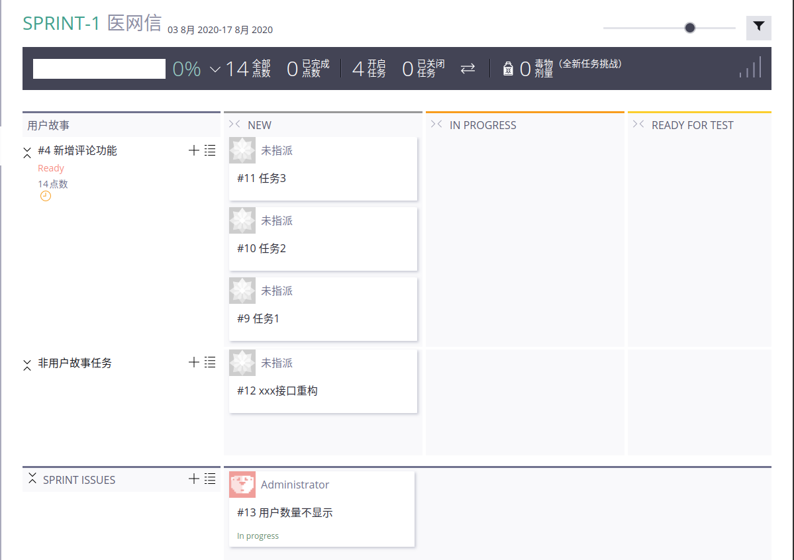

### 冲刺执行

执行过程中，大家同时完成同一个用户故事，这样可以尽早交付验收，有问题也可以及时反馈。

每天早上大家需要更新任务状态，告诉大家我今天需要做什么任务。

质控要关注任务状态的变化，一旦某个用户故事的任务都已经“ready for test”，就开始测试。

每天下班前大家需要再次更新任务状态，告诉大家我今天完成了什么任务。

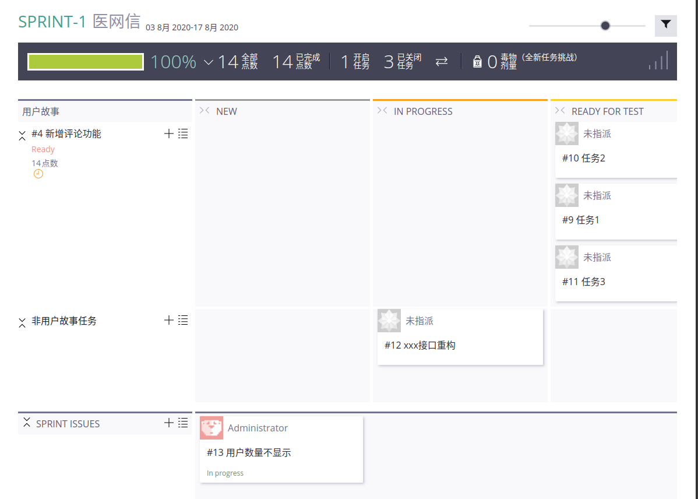

### 进度跟进

Taiga会根据任务的状态绘制燃尽图，让每个成员都可以清晰的感知目前冲刺的进度。

只有当一个用户故事下的所有任务都完成，才会认为这个用户故事已完成。

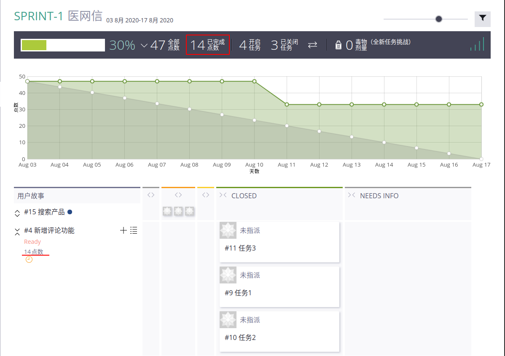

除了冲刺的燃尽图，待办列表也有一个燃尽图，它可以让我们对已经计划好的冲刺以及故事点数的完成情况有一个整体的感知。

首先在项目配置页中选中“模块”，“待办事项”下有两个配置项，一个是“期待的冲刺数量”，一个是“估计总的故事点”。这两个指标只是估算的，不需要特别精准，随着项目的推进会不断调整。

这样就可以看到燃尽图了。

## 问题管理（ISSUE）

问题的创建者通常是QA。

每个产品都有一个独立的问题列表。

每个Sprint的问题都会在这里找到。

在冲刺规划会上，需要将这个冲刺要解决的问题添加到冲刺面板上。

和其它缺陷管理的工具一样，添加问题时，相应的属性一应俱全：标题、描述、状态、标签、指派给谁、bug类型、严重程度、优先级，截止时间，也可以添加附件，如：截图。

这里的问题(issue)类型可以是缺陷(bug)，也可以是问题(question)，甚至是建议(enhancement)。

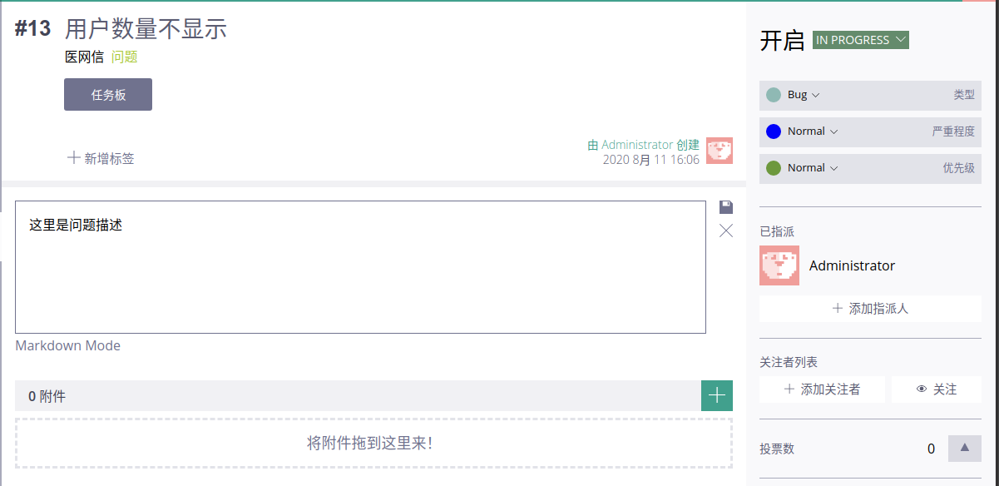

## 维基百科（WIKI）

这里主要用于提供产品的功能介绍，发布日志，FAQ等等内容，默认有一个主页，所有的页面都会平铺在左侧的列表中。

所有的页面都支持Markdown语法，不过编辑时没有提供交互式的控件，这里易用性稍微差了一些，不过对于熟悉markdown语法的人来说也不是问题。或者也可以在markdown的编辑器中编辑好，然后粘贴到这里。

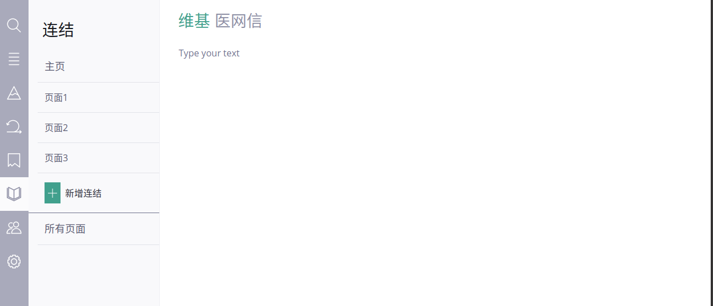

## 总结

整体感觉这是我用过的最正宗的敏捷项目管理工具，真正体现了敏捷项目管理的理念。同时操作简单，不会有太多的学习成本，真正给项目管理提供帮助，而不是负担。

